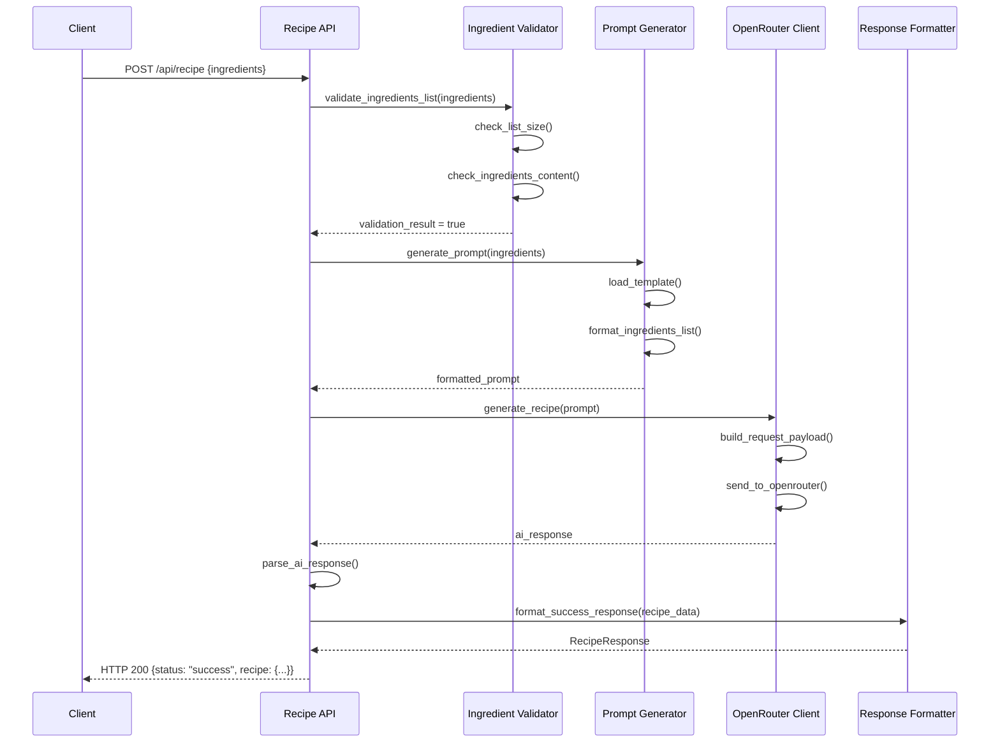
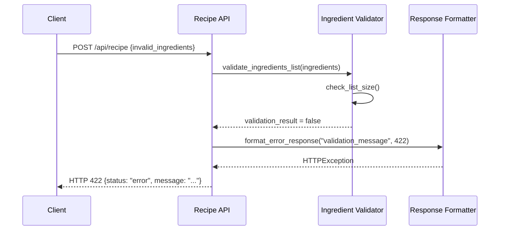
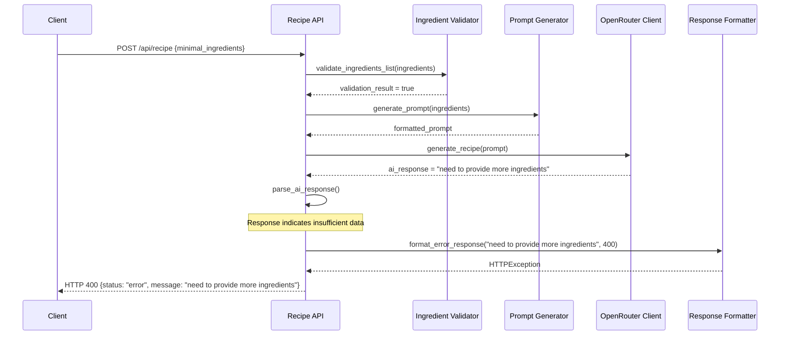
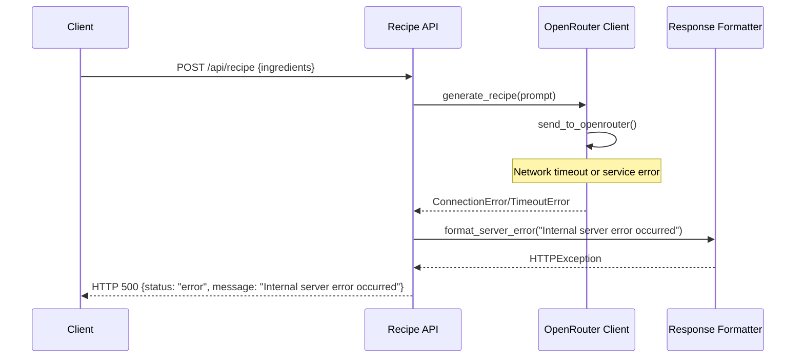

# Recipe API Design Document

## A. Executive Summary

The Recipe API endpoint (`/api/recipe`) is a core service that transforms user-provided ingredients into structured recipe recommendations using AI-powered generation. This endpoint serves as the primary interface for the RecipeBot system, enabling users to discover recipes based on available ingredients while ensuring proper validation, error handling, and response formatting.

## B. Business Requirements

### Functional Requirements

#### Recipe Generation
- **Primary Function**: Generate complete recipes from ingredient lists
- **Input Processing**: Accept 1-20 ingredients with quantity specifications
- **Output Generation**: Provide structured recipes with title, ingredients, instructions, and cooking time
- **AI Integration**: Leverage external AI services for intelligent recipe creation

#### Input Validation
- **Quantity Requirement**: All ingredients must include measurable quantities
- **Unit Validation**: Support standard mass (kg, g, lb, oz) and capacity (L, ml, cup, tbsp, tsp) units
- **Format Validation**: Ensure ingredients follow structured format (quantity + unit + ingredient name)
- **List Size Constraints**: Enforce minimum 1 and maximum 20 ingredients per request

#### Response Management
- **Success Responses**: Return structured recipe data in consistent format
- **Error Handling**: Provide clear error messages for validation failures and system errors
- **Insufficient Data Handling**: Detect when ingredients are inadequate for meaningful recipe generation

### User Stories

1. **As a home cook**, I want to input my available ingredients and receive a practical recipe, so I can make use of what I have at home
2. **As a meal planner**, I want to specify exact quantities of ingredients and get recipes that match those amounts, so I can minimize food waste
3. **As a cooking enthusiast**, I want detailed step-by-step instructions and accurate cooking times, so I can successfully prepare the recipe
4. **As a user with limited ingredients**, I want to be informed when I don't have enough ingredients for a recipe, so I know to add more items

### Business Rules and Constraints

#### Ingredient Validation Rules
- Ingredients must include both quantity and unit measurements
- Supported measurement systems: metric and imperial
- Maximum ingredient list size: 20 items
- Minimum ingredient list size: 1 item
- Empty or whitespace-only ingredients are rejected

#### Recipe Generation Rules
- AI must attempt to use all provided ingredients in the recipe
- Generated recipes must be practical and executable
- Cooking time estimates must be realistic
- Instructions must be clear and sequential

#### Error Handling Rules
- System errors do not expose internal implementation details
- Validation errors provide specific guidance for correction
- Insufficient ingredient scenarios trigger specific error responses
- All errors include actionable messages for users

## C. API Specification

### Endpoint Details

**URL**: `/api/recipe`  
**HTTP Method**: `POST`  
**Content-Type**: `application/json`  
**Authentication**: None required

### Request Data Model

```json
{
  "ingredients": [
    "string (required, 1-20 items)",
    "format: {quantity} {unit} {ingredient_name}"
  ]
}
```

**Validation Rules**:
- `ingredients`: Array of strings, required, minimum 1 item, maximum 20 items
- Each ingredient must contain quantity, unit, and ingredient name
- Supported units: kg, g, lb, oz, L, ml, cup, tbsp, tsp (and variations)

### Response Data Models

#### Success Response (HTTP 200)
```json
{
  "status": "success",
  "recipe": {
    "title": "string (1-100 characters)",
    "ingredients": ["string (formatted ingredient list)"],
    "instructions": ["string (step-by-step instructions)"],
    "cooking_time": "string (time estimate)"
  }
}
```

#### Error Response (HTTP 400/422/500)
```json
{
  "status": "error",
  "message": "string (descriptive error message)"
}
```

### Input Validation Rules

1. **Ingredient Format Validation**
   - Must match pattern: `{number} {unit} {ingredient_name}`
   - Quantity must be numeric (integers or decimals)
   - Unit must be from supported units list
   - Ingredient name must be non-empty string

2. **List Size Validation**
   - Minimum 1 ingredient required
   - Maximum 20 ingredients allowed
   - Empty arrays rejected

3. **Content Validation**
   - No empty or whitespace-only strings
   - Each ingredient must contain all required components
   - Unit case-insensitive matching

### Error Handling Scenarios

| Scenario | HTTP Status | Error Message | User Action |
|----------|-------------|---------------|-------------|
| Empty ingredient list | 422 | "Ingredients list cannot be empty" | Provide at least one ingredient |
| Too many ingredients | 422 | "Maximum 20 ingredients allowed" | Reduce ingredient count |
| Missing quantity | 422 | "Ingredient must include quantity" | Add quantity to ingredients |
| Invalid unit | 422 | "Unsupported measurement unit" | Use supported units |
| Insufficient ingredients | 400 | "need to provide more ingredients" | Add more ingredients |
| AI service failure | 500 | "Internal server error occurred" | Retry request |
| Network timeout | 500 | "Service temporarily unavailable" | Retry after delay |

## D. Business Process Flow

### Primary Recipe Generation Workflow

1. **Request Reception**
   - Receive POST request with ingredient list
   - Log request initiation with ingredient count
   - Initialize request processing context

2. **Input Validation Phase**
   - Validate request structure and format
   - Check ingredient list size constraints
   - Validate each ingredient format and units
   - Return validation errors if any issues found

3. **Ingredient Processing**
   - Parse quantities and units from ingredient strings
   - Normalize ingredient formats for AI processing
   - Validate ingredient sufficiency for recipe generation

4. **AI Prompt Generation**
   - Load prompt template from configuration
   - Insert formatted ingredients into template
   - Generate complete AI prompt with instructions

5. **External AI Service Integration**
   - Send prompt to OpenRouter AI service
   - Handle authentication and request formatting
   - Manage timeout and retry logic
   - Log request/response if enabled

6. **Response Processing**
   - Parse AI response (JSON or text format)
   - Extract recipe components (title, ingredients, instructions, time)
   - Validate response completeness
   - Handle insufficient ingredient responses

7. **Output Formatting**
   - Structure response according to API specification
   - Apply business formatting rules
   - Generate final JSON response

8. **Error Management**
   - Catch and categorize exceptions
   - Generate appropriate error responses
   - Log errors for monitoring and debugging

### Decision Points and Business Logic Branching

#### Ingredient Validation Decision Point
```
IF ingredients.length < 1 OR ingredients.length > 20
    RETURN validation_error("Invalid ingredient count")
ELSE IF any ingredient lacks quantity/unit
    RETURN validation_error("Missing quantity/unit")
ELSE
    PROCEED to AI generation
```

#### AI Response Processing Decision Point
```
IF ai_response contains "need to provide more ingredients"
    RETURN business_error("Insufficient ingredients")
ELSE IF ai_response is valid JSON with required fields
    RETURN structured_recipe
ELSE IF ai_response is parseable text
    ATTEMPT text_parsing
ELSE
    RETURN system_error("Unable to generate recipe")
```

#### Error Handling Decision Point
```
IF error_type == validation_error
    RETURN HTTP 422 with specific guidance
ELSE IF error_type == business_logic_error
    RETURN HTTP 400 with business message
ELSE IF error_type == system_error
    RETURN HTTP 500 with generic message
```

### Data Transformation Requirements

1. **Input Transformation**
   - Normalize ingredient string formats
   - Convert units to consistent format
   - Combine ingredients into comma-separated list for AI prompt

2. **AI Response Transformation**
   - Parse JSON from markdown code blocks if present
   - Extract text-based recipe components using regex patterns
   - Convert unstructured text to structured recipe format

3. **Output Transformation**
   - Apply response model validation
   - Format cooking time consistently
   - Ensure instruction steps are properly sequenced

## E. Integration Points

### Dependencies on Other Systems/Services

#### OpenRouter AI Service
- **Purpose**: External AI service for recipe generation
- **Integration Method**: HTTP REST API calls
- **Authentication**: Bearer token authentication
- **Timeout**: 30-second request timeout
- **Fallback**: No fallback service configured

#### Template System
- **Purpose**: Prompt template management
- **Integration Method**: File system access
- **Location**: `templates/prompt-template.txt`
- **Format**: Text template with placeholder substitution

#### Logging System
- **Purpose**: Application monitoring and debugging
- **Integration Method**: Internal logging framework
- **Outputs**: Application logs and request/response logs
- **Configuration**: Environment variable controlled

### External API Calls

#### OpenRouter API Integration
```
Endpoint: https://openrouter.ai/api/v1/chat/completions
Method: POST
Headers:
  - Authorization: Bearer {api_key}
  - Content-Type: application/json
  - HTTP-Referer: http://localhost:8000
  - X-Title: RecipeBot API
```

**Request Payload**:
```json
{
  "model": "{configured_model}",
  "messages": [{"role": "user", "content": "{generated_prompt}"}],
  "max_tokens": 1000,
  "temperature": 0.7
}
```

### Authentication and Authorization Requirements

#### API Endpoint Authentication
- **Current State**: No authentication required for recipe endpoint
- **Future Considerations**: May implement API key or token-based auth

#### External Service Authentication
- **OpenRouter API**: Requires API key via environment variable `OPENROUTER_API_KEY`
- **Key Management**: Environment variable based, not stored in code
- **Security**: API key masked in logs for security

### Data Persistence Requirements

#### Current Implementation
- **No Database**: System is stateless with no data persistence
- **Logging Only**: Request/response logging to file system if enabled
- **Session Management**: No user session management required

#### Future Considerations
- **Recipe Storage**: May implement recipe caching or user history
- **Usage Analytics**: Could add request tracking and usage metrics
- **User Preferences**: Potential for user-specific recipe preferences

## F. Sequence Diagrams

### Success Flow - Recipe Generation



### Error Flow - Validation Failure



### Error Flow - Insufficient Ingredients



### Error Flow - System Failure



## G. Data Management

### Data Persistence Requirements

#### Current Architecture
- **Stateless Design**: No persistent data storage required
- **Request-Response Model**: Each request is independent
- **No User Sessions**: No user state or session management

#### Data Flow Patterns
1. **Input Data**: Received via HTTP request body, validated, and processed
2. **Intermediate Data**: Transformed through validation and prompt generation pipelines
3. **External Data**: AI-generated content retrieved from external service
4. **Output Data**: Structured and formatted for API response

### CRUD Operation Specifications

#### Current Implementation
- **Create**: Recipe generation (not persistent)
- **Read**: Template file reading for prompt generation
- **Update**: Not applicable in current stateless design
- **Delete**: Not applicable in current stateless design

#### Logging Operations
- **Create**: Request/response log entries (if enabled)
- **Read**: Template file access, configuration reading
- **Update**: Log file updates
- **Delete**: Automatic log cleanup (not implemented)

### Data Validation and Business Rules

#### Input Data Validation
1. **Structural Validation**: JSON schema compliance
2. **Business Rule Validation**: Ingredient format and quantity requirements
3. **Constraint Validation**: List size and content constraints
4. **Unit Validation**: Measurement unit verification

#### Data Transformation Validation
1. **AI Response Validation**: JSON structure and required field presence
2. **Content Validation**: Recipe component completeness
3. **Format Validation**: Output model compliance

#### Error Data Management
1. **Error Categorization**: Validation, business logic, and system errors
2. **Error Message Standardization**: Consistent error response formats
3. **Error Logging**: Comprehensive error tracking for debugging

### Data Security Considerations

#### Sensitive Data Handling
- **API Keys**: Stored in environment variables, masked in logs
- **User Input**: No sensitive user data collected or stored
- **Request Logging**: Optional feature with security considerations

#### Data Privacy
- **No Personal Data**: System processes only ingredient information
- **Request Isolation**: No cross-request data sharing
- **Temporary Processing**: All data processing is transient

## H. Non-Functional Requirements

### Performance Expectations

#### Response Time Requirements
- **Target Response Time**: < 5 seconds for standard requests
- **AI Service Dependency**: Response time primarily limited by external AI service
- **Timeout Configuration**: 30-second maximum timeout for AI requests
- **Validation Performance**: < 100ms for ingredient validation

#### Throughput Requirements
- **Concurrent Requests**: Support multiple simultaneous recipe generations
- **Resource Utilization**: Efficient memory usage for ingredient processing
- **Scalability**: Stateless design enables horizontal scaling

#### Resource Consumption
- **Memory**: Minimal memory footprint due to stateless design
- **CPU**: Low CPU usage for validation and text processing
- **Network**: Dependent on external AI service availability
- **Storage**: Optional request logging with configurable retention

### Security Considerations

#### Input Security
- **Input Sanitization**: Validation prevents malformed ingredient data
- **Injection Prevention**: Template-based prompt generation prevents prompt injection
- **Size Limits**: Maximum ingredient count prevents resource exhaustion

#### API Security
- **No Authentication**: Current implementation has no auth requirements
- **Rate Limiting**: Not currently implemented (future consideration)
- **CORS**: Configurable for cross-origin requests

#### External Service Security
- **API Key Management**: Secure environment variable storage
- **Request Logging**: API keys masked in logged requests
- **HTTPS Communication**: All external API calls use encrypted connections

#### Error Handling Security
- **Information Disclosure**: Error messages do not expose internal implementation
- **Logging Security**: Sensitive information excluded from logs
- **Exception Handling**: Comprehensive exception catching prevents data leaks

### Scalability Requirements

#### Horizontal Scalability
- **Stateless Design**: Enables easy horizontal scaling across multiple instances
- **No Session State**: Each request is independent and can be handled by any instance
- **External Dependencies**: Scaling limited primarily by AI service capacity

#### Vertical Scalability
- **Resource Efficiency**: Low resource consumption per request
- **Memory Management**: Efficient ingredient processing and validation
- **CPU Utilization**: Lightweight text processing operations

#### Load Distribution
- **Load Balancing**: Compatible with standard load balancing approaches
- **Service Isolation**: Recipe generation isolated from other potential services
- **Failure Isolation**: Individual request failures do not affect other requests

### Monitoring and Observability

#### Application Monitoring
- **Request Logging**: Comprehensive request/response logging capability
- **Error Tracking**: Detailed error logging with categorization
- **Performance Metrics**: Response time and throughput monitoring potential

#### Health Monitoring
- **Health Check Endpoint**: `/health` endpoint for service status
- **Dependency Monitoring**: External AI service availability tracking
- **Resource Monitoring**: System resource usage monitoring

#### Operational Requirements
- **Log Management**: Configurable logging levels and destinations
- **Configuration Management**: Environment-based configuration
- **Deployment Flexibility**: Container-friendly stateless design

### Reliability Requirements

#### Error Recovery
- **Graceful Degradation**: Clear error messages when AI service unavailable
- **Timeout Handling**: Appropriate timeout management for external calls
- **Exception Management**: Comprehensive exception handling and logging

#### Service Reliability
- **Single Point of Failure**: External AI service dependency
- **Retry Logic**: Basic retry capability for transient failures
- **Circuit Breaker**: Not currently implemented (future consideration)

#### Data Integrity
- **Input Validation**: Comprehensive validation prevents invalid processing
- **Output Validation**: Response model validation ensures data integrity
- **Error Consistency**: Consistent error response formats